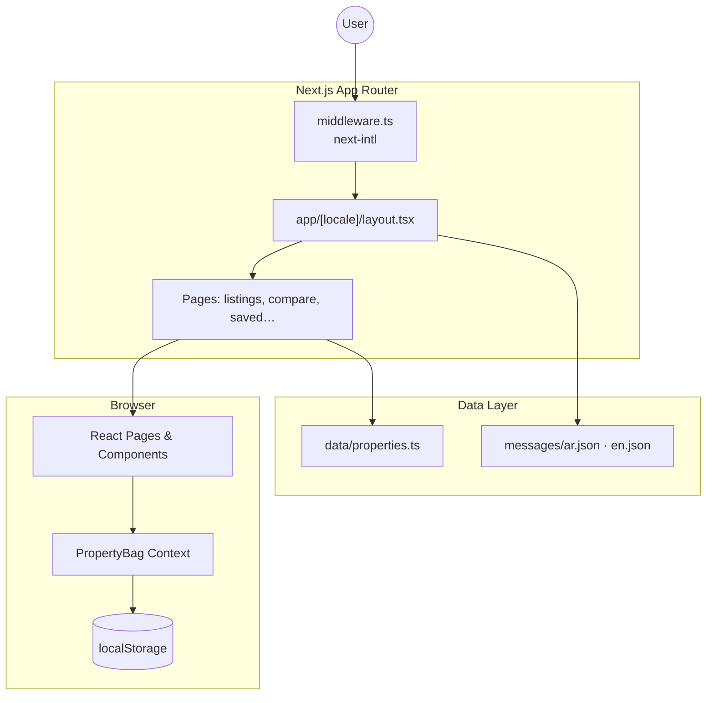
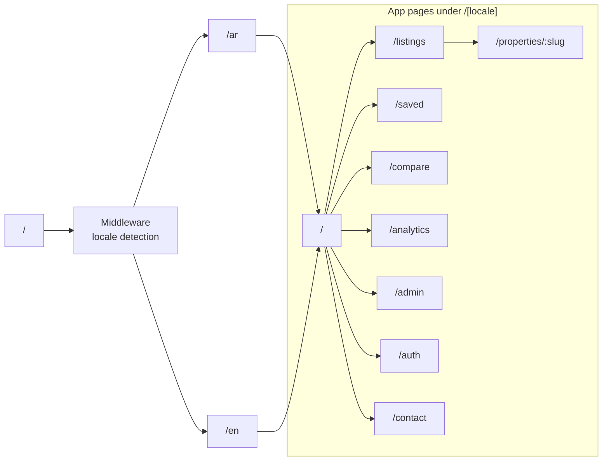
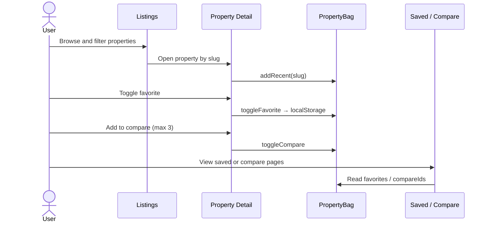
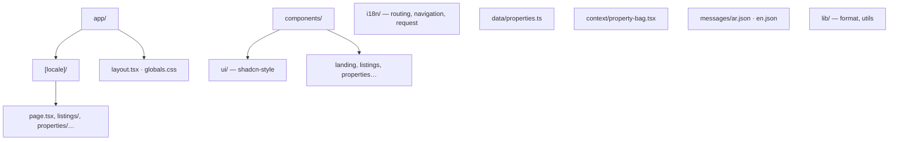
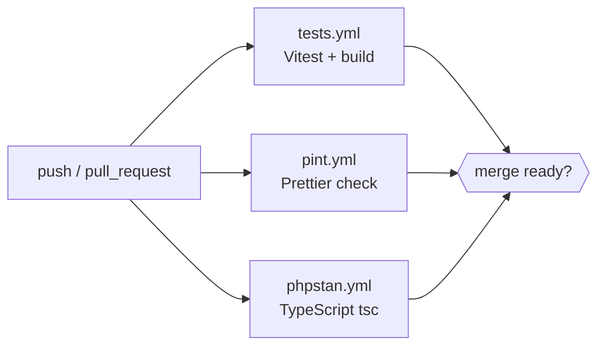

# Nile Key Realty

A multilingual **Next.js 16** real-estate showcase for Egyptian properties (sale and rent). Browse listings, compare units, save favorites, view analytics, and explore a demo admin dashboard — with full **Arabic (RTL)** and **English** support via [next-intl](https://next-intl-docs.vercel.app/).

## Status


## Features

- Bilingual routing: `ar` (default) and `en`
- Property listings with filters and search
- Analytics dashboard (Recharts)
- Side-by-side compare (up to 3 properties)
- Favorites and recently viewed (localStorage)
- Demo admin dashboard
- CI: tests, formatting, and static analysis

---

## Architecture



---

## Routing



---

## User flows



---

## Project structure



---

## CI pipeline



---

## Tech stack

| Layer     | Tools                   |
| --------- | ----------------------- |
| Framework | Next.js 16, React 19    |
| Styling   | Tailwind CSS 4          |
| i18n      | next-intl               |
| UI        | Radix UI, Framer Motion |
| Charts    | Recharts                |
| Tests     | Vitest                  |
| CI        | GitHub Actions          |

---

## Getting started

```bash
npm install
cp .env.example .env   # optional
npm run dev
```

Open [http://localhost:3000](http://localhost:3000) — you will be redirected to `/ar` or `/en`.

### Environment

| Variable               | Description                                                        |
| ---------------------- | ------------------------------------------------------------------ |
| `NEXT_PUBLIC_SITE_URL` | Canonical base URL for metadata (default: `http://localhost:3000`) |

---

## Scripts

| Command                | Description                |
| ---------------------- | -------------------------- |
| `npm run dev`          | Start development server   |
| `npm run build`        | Production build           |
| `npm run start`        | Run production server      |
| `npm run lint`         | ESLint                     |
| `npm test`             | Vitest unit tests          |
| `npm run typecheck`    | TypeScript static analysis |
| `npm run format:check` | Verify Prettier formatting |
| `npm run format`       | Apply Prettier formatting  |

---

## CI

Workflows in [`.github/workflows/`](.github/workflows/):

| Workflow      | Purpose                              |
| ------------- | ------------------------------------ |
| `tests.yml`   | Unit tests + production build        |
| `pint.yml`    | Prettier — fails on formatting drift |
| `phpstan.yml` | `tsc` static analysis                |

---

## Learn more

- [Next.js Docs](https://nextjs.org/docs)
- [next-intl Docs](https://next-intl-docs.vercel.app/)

## Deploy

Deploy on [Vercel](https://vercel.com/new?utm_medium=default-template&filter=next.js&utm_source=create-next-app&utm_campaign=create-next-app-readme) or any Node.js host that supports Next.js.

---

## License

Private demo project — adjust the license as needed for open source release.
